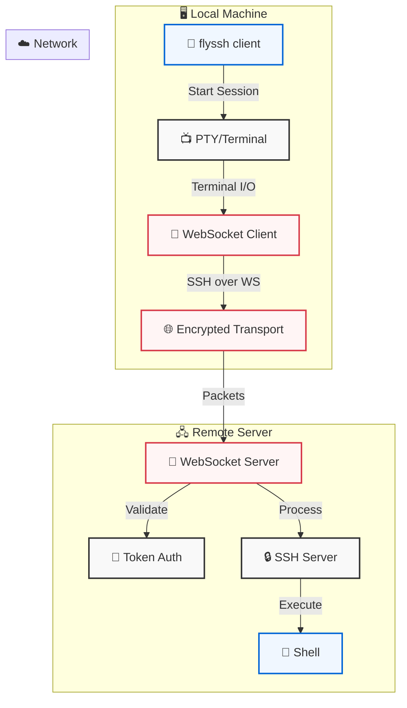

# SSH over WebSocket CLI

A command-line tool that lets you SSH into remote machines through WebSocket connections, enabling SSH access through environments where traditional SSH ports are blocked or unavailable. The tool includes both client and server components, with the server being a lightweight component that enables the WebSocket transport.

## Features

- SSH through WebSocket transport (works where traditional SSH ports are blocked)
- Full terminal support with all the features you expect from SSH:
  * Interactive shell with PTY support
  * Window resizing
  * Environment variables
  * Non-interactive command execution
  * Uses your default shell (zsh, bash, etc.)
- Simple token-based authentication
- Secure communication with SSH encryption
- Cross-platform support

## Usage

### Client Mode

Connect to a remote machine through WebSocket:

```bash
# Set the authentication token provided by the server
export WSS_AUTH_TOKEN=server-token

# Start an interactive session
flyssh client ws://server-address:8081

# Or run a specific command
flyssh client ws://server-address:8081 -- ls -la
```

Client options:
- `--term`: Terminal type (default: xterm)
- `--cols`: Terminal width (auto-detected by default)
- `--rows`: Terminal height (auto-detected by default)

### Server Mode

The server component needs to be running on the remote machine you want to connect to. It's typically set up once and left running:

```bash
# Generate an authentication token (save this for client use)
flyssh auth generate-token

# Start the server
export WSS_AUTH_TOKEN=your-generated-token
flyssh server
```

Server options:
- `--ws-port`: WebSocket port (default: 8081)
- `--host`: Host to bind to (default: localhost)

## Architecture



Flow sequence:
1. Client initiates a session with terminal handling
2. Terminal I/O is managed by the PTY subsystem
3. All data is wrapped in SSH protocol and sent over WebSocket
4. Encrypted packets traverse the network
5. Server validates the WebSocket connection using token auth
6. SSH protocol is processed by the SSH server
7. Commands are executed in a shell with full TTY support

All SSH protocol handling (encryption, authentication, channel management) happens within the client and server components, while WebSocket provides the transport layer.

## Security

- WebSocket server requires Bearer token authentication
- All communication is encrypted using SSH protocol
- Host keys are automatically generated and managed
- No need to modify system SSH configuration

## Development Setup

1. Clone the repository:
```bash
git clone https://github.com/superfly/flyssh.git
cd flyssh
```

2. Install Go (1.21 or later)

3. Build the tool:
```bash
go build -o flyssh ./cmd/flyssh
```

4. Run tests:
```bash
go test -v ./...
```

## Examples

1. Start a server and connect from another terminal:
```bash
# Terminal 1: Start server
export WSS_AUTH_TOKEN=secret-token
flyssh server

# Terminal 2: Connect client
export WSS_AUTH_TOKEN=secret-token
flyssh client ws://localhost:8081
```

2. Run a remote command:
```bash
flyssh client ws://server:8081 -- uname -a
```

3. Start server on custom ports:
```bash
flyssh server --ssh-port 2223 --ws-port 8082
```

## Troubleshooting

Common issues and solutions:

1. Authentication errors:
```bash
# Verify token is set
echo $WSS_AUTH_TOKEN

# Generate new token
flyssh auth generate-token
```

2. Connection issues:
```bash
# Enable debug logging
flyssh server --debug
flyssh client --debug ws://server:8081
```

3. Port conflicts:
```bash
# Use different ports
flyssh server --ssh-port 2223 --ws-port 8082
```