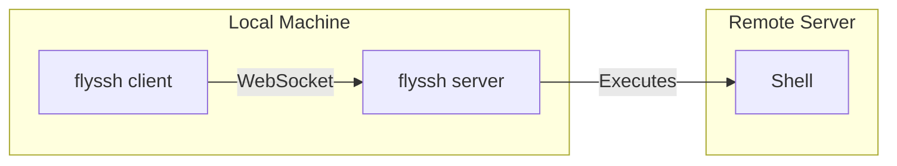

# SSH over WebSocket CLI

A command-line tool that enables SSH connections over WebSocket, with built-in server and client functionality. No external tooling required.

## Features

- All-in-one CLI tool for both server and client operations
- Full-featured SSH server implementation (no system sshd required)
  * Interactive shell with PTY support
  * Window resizing
  * Environment variables
  * Non-interactive command execution
  * Uses your default shell (zsh, bash, etc.)
- WebSocket transport with Bearer token authentication
- Secure communication with SSH encryption
- Cross-platform support

## Usage

### Server Mode

Start an SSH server that accepts connections over WebSocket:

```bash
# Generate an authentication token
flyssh auth generate-token

# Start the server (save the token for client use)
export WSS_AUTH_TOKEN=your-generated-token
flyssh server
```

Server options:
- `--ssh-port`: SSH server port (default: 2222)
- `--ws-port`: WebSocket server port (default: 8081)
- `--host`: Host to bind to (default: localhost)

### Client Mode

Connect to a remote SSH-over-WebSocket server:

```bash
# Set the authentication token
export WSS_AUTH_TOKEN=server-token

# Connect to the server
flyssh client ws://server-address:8081

# Or run a specific command
flyssh client ws://server-address:8081 -- ls -la
```

Client options:
- `--term`: Terminal type (default: xterm)
- `--cols`: Terminal width (auto-detected by default)
- `--rows`: Terminal height (auto-detected by default)

## Architecture



## Security

- WebSocket server requires Bearer token authentication
- All communication is encrypted using SSH protocol
- Host keys are automatically generated and managed
- No need to modify system SSH configuration

## Development Setup

1. Clone the repository:
```bash
git clone https://github.com/superfly/flyssh.git
cd flyssh
```

2. Install Go (1.21 or later)

3. Build the tool:
```bash
go build -o flyssh ./cmd/flyssh
```

4. Run tests:
```bash
go test -v ./...
```

## Examples

1. Start a server and connect from another terminal:
```bash
# Terminal 1: Start server
export WSS_AUTH_TOKEN=secret-token
flyssh server

# Terminal 2: Connect client
export WSS_AUTH_TOKEN=secret-token
flyssh client ws://localhost:8081
```

2. Run a remote command:
```bash
flyssh client ws://server:8081 -- uname -a
```

3. Start server on custom ports:
```bash
flyssh server --ssh-port 2223 --ws-port 8082
```

## Troubleshooting

Common issues and solutions:

1. Authentication errors:
```bash
# Verify token is set
echo $WSS_AUTH_TOKEN

# Generate new token
flyssh auth generate-token
```

2. Connection issues:
```bash
# Enable debug logging
flyssh server --debug
flyssh client --debug ws://server:8081
```

3. Port conflicts:
```bash
# Use different ports
flyssh server --ssh-port 2223 --ws-port 8082
```