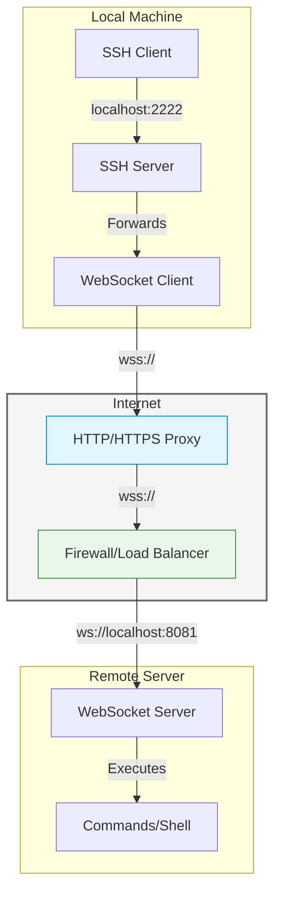

# SSH to WebSocket Bridge

A secure bridge that allows SSH connections to be forwarded over WebSocket, with authentication support.

## Features

- Full-featured SSH server implementation (no system sshd required)
  * Interactive shell with PTY support
  * Window resizing
  * Environment variables
  * Non-interactive command execution
  * Uses your default shell (zsh, bash, etc.)
- WebSocket server with Bearer token authentication
- Command execution and interactive shell support
- Secure communication with SSH encryption

## Architecture



## Authentication

The WebSocket server requires authentication using a Bearer token. Set the token in the environment variable:

```bash
export WSS_AUTH_TOKEN=your-secret-token
```

When connecting to the WebSocket server, include the Authorization header:

```
Authorization: Bearer your-secret-token
```

## Usage

1. Start the bridge:
```bash
go run main.go [options]
```

Options:
- `-ssh-port`: SSH server port (default: 2222)
- `-ws-port`: WebSocket server port (default: 8081)
- `-key`: Path to SSH host key (default: "host.key")

2. Connect via SSH:
```bash
ssh -p 2222 localhost
```

3. Connect via WebSocket:
```javascript
const ws = new WebSocket('ws://localhost:8081');
ws.setRequestHeader('Authorization', 'Bearer your-secret-token');
```

## Security

- Local SSH server accepts all connections (no authentication required)
- Remote WebSocket server requires Bearer token authentication
- All communication is encrypted using SSH protocol
- Host key is used for SSH server identification

## Development Setup

1. Clone the repository:
```bash
git clone https://github.com/yourusername/flyssh.git
cd flyssh
```

2. Install Go (1.21 or later):
```bash
# macOS with Homebrew
brew install go

# Linux
# See https://golang.org/doc/install
```

3. Install dependencies:
```bash
go mod download
```

4. Generate a development token:
```bash
go run main.go -generate-token
export WSS_AUTH_TOKEN=<generated-token>
```

5. Run tests:
```bash
go test -v ./...
```

6. Start the server in development mode:
```bash
go run main.go -ssh-port 2222 -ws-port 8081
```

## Deployment

### Server Component

1. Build the server:
```bash
go build -o flyssh
```

2. Generate a secure token:
```bash
./flyssh -generate-token
```

3. Set up environment:
```bash
# Store token securely (e.g., in systemd environment file)
echo "WSS_AUTH_TOKEN=your-generated-token" > /etc/flyssh/env
```

4. Create systemd service (optional):
```ini
[Unit]
Description=SSH to WebSocket Bridge Server
After=network.target

[Service]
ExecStart=/usr/local/bin/flyssh -ws-port 8081
EnvironmentFile=/etc/flyssh/env
Restart=always
User=flyssh
Group=flyssh

[Install]
WantedBy=multi-user.target
```

5. Start the service:
```bash
sudo systemctl enable flyssh
sudo systemctl start flyssh
```

### Client Setup

1. Build the client:
```bash
go build -o flyssh-client
```

2. Configure authentication:
```bash
# Store token securely
echo "WSS_AUTH_TOKEN=your-token" > ~/.flyssh/config
chmod 600 ~/.flyssh/config
```

3. Start the client:
```bash
./flyssh-client -remote ws://your-server:8081
```

4. Connect via SSH:
```bash
ssh -p 2222 localhost
```

## Troubleshooting

Common issues and solutions:

1. Port conflicts:
```bash
# Check if ports are in use
lsof -i :2222
lsof -i :8081

# Use different ports
go run main.go -ssh-port 2223 -ws-port 8082
```

2. Authentication issues:
```bash
# Verify token is set
echo $WSS_AUTH_TOKEN

# Generate new token
go run main.go -generate-token
```

3. Connection issues:
```bash
# Enable debug logging
go run main.go -debug

# Test WebSocket connection
wscat -c ws://localhost:8081 -H "Authorization: Bearer $WSS_AUTH_TOKEN"
```